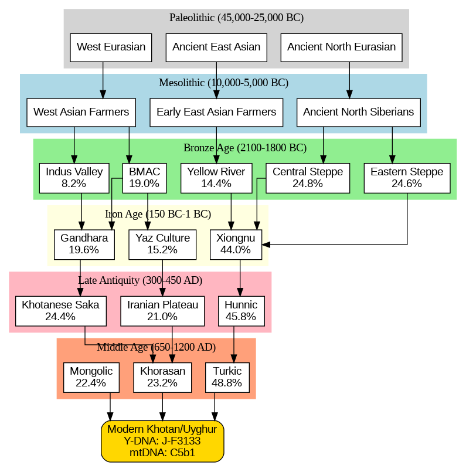

## Do you have your mtDNA and Y-DNA results, as well as IllustrativeDNA results categorized by historical periods and farming communities? If so, I can help you generate migration maps for just €5—an affordable and valuable service. Feel free to reach out if you're interested! https://x.com/Yusufrozimemet

# GPS-Uyghur
## Autosomal DNA migration analysis

You can view the interactive migration map [here](https://github.com/Yusuprozimemet/GPS-Uyghur/blob/main/ancestry_migration_map.html)

## Maternal-Paternal lineage migration analysis

You can view the interactive migration map [here](https://github.com/Yusuprozimemet/GPS-Uyghur/blob/main/dual_lineage_migration_map.html)

## Autosomal DNA general analysis

## Autosomal DNA detail analysis

# Tales of Two Lineages: A Journey Through Time

## The Maternal Line: Daughters of the Siberian Expanse

In the shadows of the last ice age, when mammoths still roamed the Earth, our maternal story begins near Lake Baikal. Here, around 15,000 BCE, a woman carried a distinctive genetic signature - mtDNA C5 - that would eventually become C5b1, marking the beginning of our maternal lineage. These early ancestors were likely hunter-gatherers, expertly adapted to life in the harsh Siberian environment, following the great herds across the endless steppes.

As the ice retreated and the world grew warmer, these people remained near Lake Baikal, their lives intertwined with the sacred waters that had sustained them for generations. By the Bronze Age, around 3000-2000 BCE, their descendants had developed sophisticated fishing techniques and began to incorporate early forms of animal husbandry into their traditional hunting practices. The archaeological record shows evidence of their growing settlements, with findings of intricate jewelry made from local materials suggesting complex social structures and trade networks.

The Iron Age brought dramatic changes as these people began moving southward into Mongolia. Around 1000-500 BCE, our maternal ancestors became part of the emerging Xiongnu confederation - the first great nomadic empire of the steppes. They were horse warriors now, masters of the bow and the seasonal migrations that defined life on the grasslands. Their genetic signature, C5b1, became one thread in the complex tapestry of Xiongnu society.

The next major migration came during Late Antiquity (300-600 CE), as our ancestors moved westward into the Altai region. This mountainous terrain, where Russia, China, Mongolia, and Kazakhstan meet today, became their home for several generations. Here, they likely participated in the rich cultural exchange along the emerging Silk Road networks, their traditional nomadic lifestyle adapting to new opportunities for trade and cultural exchange.

By the Medieval period (600-1000 CE), the family had reached the Tarim Basin, that great depression in Central Asia surrounded by some of the world's most formidable mountain ranges. Their final migration brought them to Khotan, an oasis city that would become their permanent home, where their descendants live to this day.

## The Paternal Line: Sons of the Fertile Crescent

Meanwhile, half a world away, our paternal story began in the Zagros Mountains around 10,000 BCE. These early farmers carried the Y-DNA J marker, placing them among the world's first agricultural societies. In the fertile valleys between the mountains, they cultivated the wild grasses that would become our modern wheat and barley, slowly transforming human civilization through their agricultural innovations.

As their farming techniques improved, these people moved into the heartland of Mesopotamia during the Bronze Age (3000-2000 BCE). They were part of the great urbanizing movements that gave rise to the world's first cities. Their descendants lived through the rise of writing, the construction of ziggurats, and the establishment of the first complex state societies.

A dramatic shift occurred around 2000-1600 BCE when some family members migrated northeast into the Bactria-Margiana Archaeological Complex (BMAC). This sophisticated Bronze Age civilization represented a crucial crossing point between the settled agricultural societies of the West and the nomadic cultures of the steppes. Here, our ancestors likely became merchants or craftsmen, participating in the growing trade networks that would eventually become the Silk Road.

The Iron Age (1000-500 BCE) saw the family move further east into the Fergana Valley, a crucial crossroads of Central Asia. This fertile valley, surrounded by mountains, became a vital link in the emerging Silk Road trade networks. Our ancestors probably played a role in the exchange of goods, ideas, and technologies between East and West.

## The Convergence: Where East Meets West

The remarkable journey of these two lineages - one from the heart of Siberia, the other from the cradle of civilization - finally converged in Khotan. This oasis city, nestled on the southern edge of the Taklamakan Desert, became the meeting point where our maternal and paternal lines finally intersected, bringing together thousands of years of human migration and adaptation.

Today, their descendants carry these ancient genetic markers - mtDNA C5b1 from the Siberian forests and Y-DNA J F3133 from the Fertile Crescent - testament to the extraordinary journeys their ancestors undertook. Their story is written not just in their DNA, but in the very landscapes their ancestors crossed: the pristine waters of Lake Baikal, the windswept steppes of Mongolia, the towering peaks of the Altai, the fertile valleys of Mesopotamia, and the bustling oasis cities of Central Asia.

This convergence of lineages in Khotan represents more than just the meeting of two family lines - it embodies the broader story of human migration and cultural exchange that has shaped our species' history. It reminds us that we are all, in our own way, products of such epic journeys, our ancestors' paths crossing and recrossing the vast landscapes of Eurasia, each generation adding its own chapter to our shared human story.
