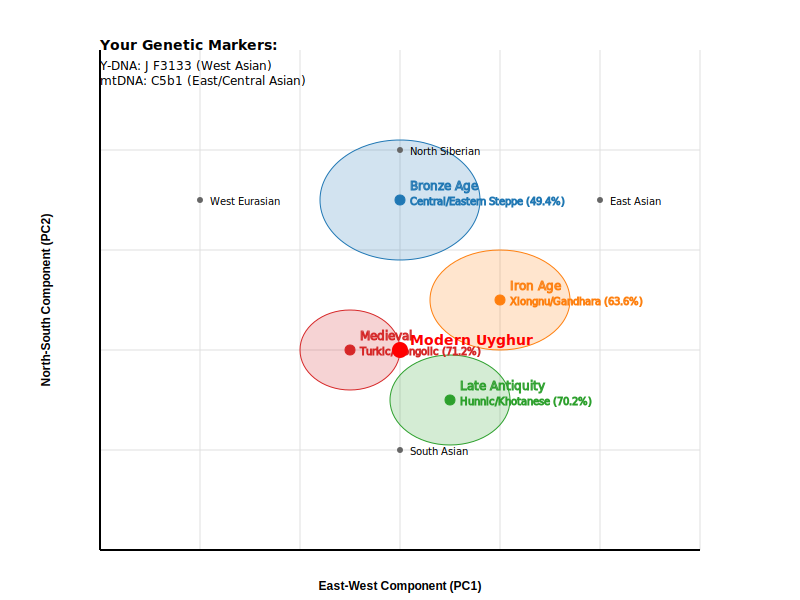

# GPS-Uyghur

## Autosomal DNA analysis

## Maternal-Paternal lineage migration analysis

You can view the interactive migration map [here](https://github.com/Yusuprozimemet/GPS-Uyghur/blob/main/dual_lineage_migration_map.html)

# My Ancestral Migration Paths

## Bronze Age (2100-1800 BC)
My DNA reveals a substantial mix from the Central and Eastern Steppe (approximately **49% combined**), coupled with genetic markers from the **Bactria–Margiana Archaeological Complex (BMAC)** at **19%** and the **Yellow River region** at **14%**. This suggests that my ancestors were engaged in the intricate exchanges between steppe nomads, the early civilizations of Central Asia, and agricultural societies in East Asia.

## Iron Age (150 BC-1 BC)
With a strong **Xiongnu** component (**44%**), my genetic profile indicates deep ties to the nomadic confederacies of the eastern steppes. The presence of **Gandhara** and **Yaz culture** elements implies that my forebears participated in the migrations along the **Inner Asian Mountain Corridor**, connecting different parts of Central Asia.

## Late Antiquity (300-450 AD)
The significant **Hunnic** genetic marker (**45.8%**) alongside **Khotanese Saka** (**24.4%**) points to my lineage being part of the sweeping migrations during the Hun period, while still maintaining links to the cultural mosaic of the **Tarim Basin**.

## Medieval Period (650-1200 AD)
A high **Turkic** genetic signature (**48.8%**) dovetails with my **Uyghur linguistic heritage**, reflecting the era when Turkic languages gained dominance in the region. Additional **Mongolic** and **Khorasan** influences further illustrate the ongoing interactions with neighboring ethnic groups.

## My Specific Haplogroups
- **Y-haplogroup J (F3133):** Traces back to West Asian origins, suggesting a lineage from that area.
- **mtDNA C5b1:** Indicative of East and Central Asian ancestry, highlighting another directional influence on my genetic makeup.

## Visualizing Migration
- **Blue Lines:** Represent the movements during the Bronze Age from the steppes and BMAC.
- **Orange Lines:** Depict the Iron Age influence of the Xiongnu and Gandhara cultures.
- **Green Lines:** Mark the migrations in Late Antiquity associated with the Huns.
- **Red Lines:** Show the medieval expansion of Turkic populations.

This intricate genetic tapestry beautifully encapsulates why the **Uyghur language and identity** are a unique blend of **Eastern and Western Eurasian cultural and genetic influences**.

